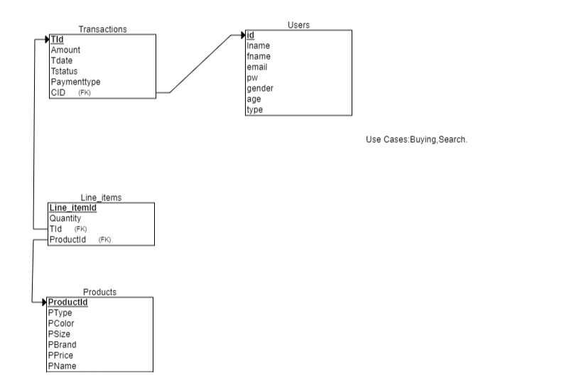

	# Ashley and Yash final project

<ol>
  <li>Ashely,Yashaswini</li>
  <li>Narration:An e-commerce application to purchase clothing</li>
  <li>Describe your user types</li>
	<ol>
		<li>Customer</li>
		<li>Customer use cases:Searches for clothing,add to cart and check out</li>
		<li>Employee</li>
		<li>Employee use cases:Add or delete a product, Can change the price for clothing</li>
	</ol>
username  		|  password  | type 
-------------	| -----------| ------
abc@gmail.com   | 123        | employee
jim@sur.com  	| 1234       | customer

 
