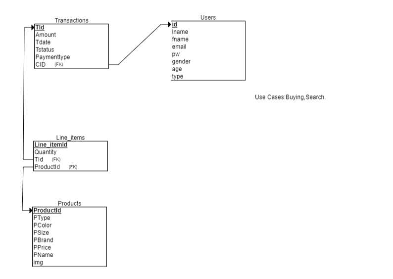

	#E-Commerce Web Application
<ol>
  <li>Yashaswini</li>
  <li>Narration:An e-commerce application to purchase clothing</li>
  <li>Describe your user types</li>
	<ol>
		<li>Customer</li>
		<li>Customer use cases:Searches for clothing,add to cart and check out</li>
		<li>Employee</li>
		<li>Employee use cases:Add or delete a product, Can change the price for clothing</li>
	</ol>
	<table>
    <tr>
        <th>username</th>
        <th>password</th>
        <th>type</th>
    </tr>
    <tr>
        <td>abc@gmail.com</td>
        <td>123</td>
        <td>customer</td>
    </tr>
    <tr>
        <td>jim@sur.com	</td>
        <td>1234</td>
        <td>employee</td>
    </tr>
	</table>
	

	#SQL Queries:
			--Used in Transaction.py--
	SELECT * FROM AY_Transactions where Tstatus=%s AND CID=%s
	
	Get an open transaction for the current customer,Tstatus=%s is for the value Open and CID=%s is to get the current customer
				  
				  
			--Used in Line_Items.py--		  
	SELECT * FROM AY_Line_items 
        left join AY_Products on AY_Products.ProductId=AY_Line_items.ProductId where TId=%s 

	Get all the line items for specific Transaction ID where product id is same in both the Products and Line items table
 
